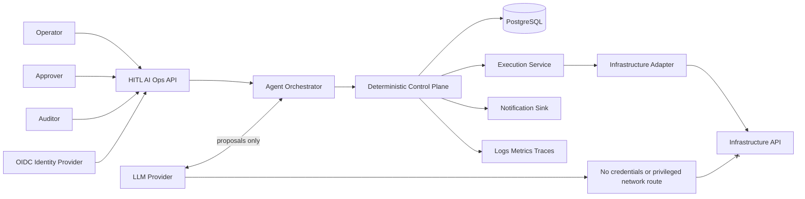
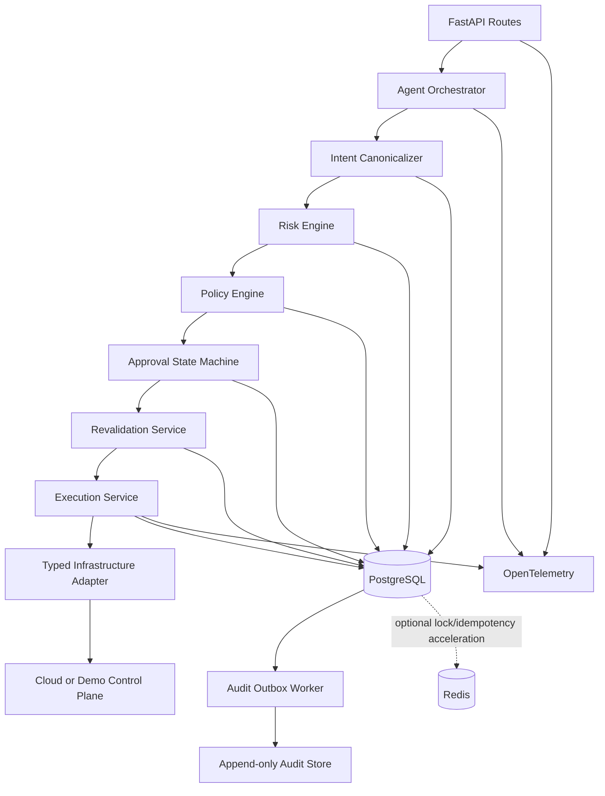
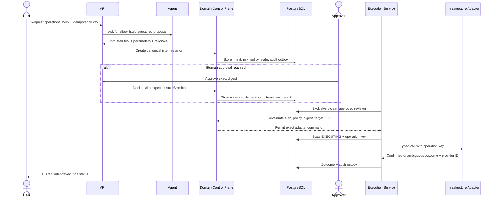
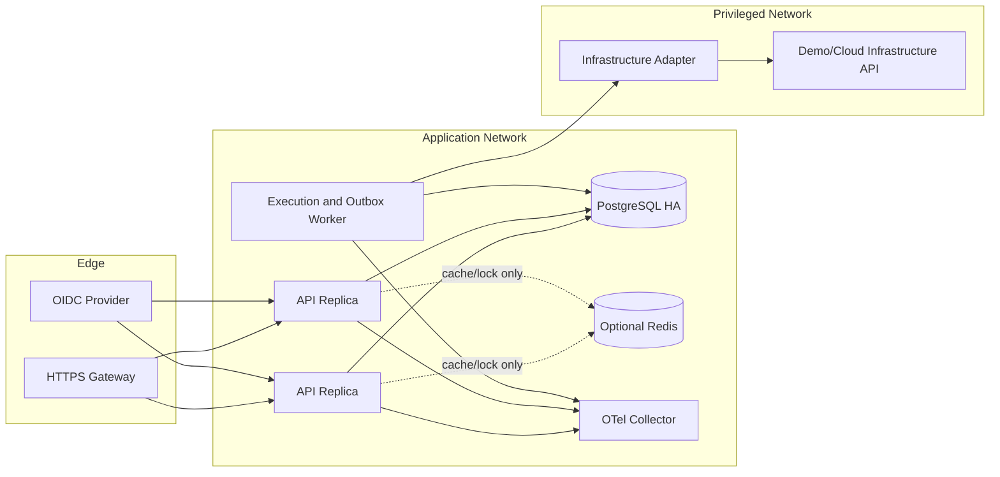

# High-Level Design

**Status:** PROPOSED_FOR_REVIEW

## 1. System context

The service is a control plane, not a privileged chatbot. Human/API clients authenticate at the boundary. The LLM produces an untrusted candidate tool call. Only the deterministic control plane can create executable intent and only the isolated execution service owns scoped infrastructure credentials.

## 2. Component architecture

### Responsibilities

| Component | Owns | Must not own |
|---|---|---|
| API | authentication context, validation, stable contracts | state or policy logic |
| Agent Orchestrator | prompt/model interaction, proposal parsing | business authority, credentials |
| Intent Canonicalizer | allow-list validation, normalization, digest, revisions | risk decisions |
| Risk Engine | deterministic risk band/factors | state mutation |
| Policy Engine | decision, route, obligations, TTL | approval persistence |
| State Machine | legal transitions and guards | provider calls |
| Revalidation Service | current digest, policy, auth, TTL, target checks | changing approved parameters |
| Execution Service | exclusive claim, idempotent operation lifecycle, reconciliation | arbitrary dynamic tools |
| Adapter | typed provider translation and status lookup | policy or approval logic |
| Audit Outbox | reliable audit and notification publication | primary transaction decisions |

## 3. Action execution sequence

## 4. Runtime and deployment

Only workers/adapters reside on a network path with infrastructure access. API and agent components cannot reach provider control-plane endpoints. For a learning deployment these processes may share one container network, but identities and module boundaries remain distinct.

## 5. Data ownership

PostgreSQL owns intents, revisions, risk evaluations, policy evaluations, approval decisions, state transitions, executions, idempotency records, authorization assignments, and audit outbox rows. Infrastructure providers own the actual resource state and provider audit IDs. The audit sink is append-only evidence derived reliably from the transactional outbox. Redis, if introduced, owns no unrecoverable information.

## 6. Availability and failure model

- PostgreSQL unavailable: reject mutations; reads may use a clearly marked stale replica only for non-authoritative views.
- Identity provider unavailable: existing validated short-lived tokens may work within configured validation rules; new/uncertain authorization fails closed.
- LLM unavailable: direct structured intent API remains usable; no action is invented.
- Redis unavailable: fall back to PostgreSQL constraints/locks with lower throughput.
- Notification unavailable: approval remains pending; outbox retries notification delivery.
- Adapter timeout after send: enter `EXECUTION_UNKNOWN`; reconcile by operation key/provider ID.
- Audit sink unavailable: primary state can commit with outbox; alarm on backlog and retry without loss.

## 7. Generic core without workflow-platform scope

Reusable domain concepts are `ActionIntent`, risk result, policy decision, approval route, transition, execution, and audit event. V1 tool schemas, risk rules, and one adapter remain explicit code. There is no runtime workflow definition language, drag-and-drop builder, arbitrary plugin execution, or tenant-authored policy DSL.

## 8. Technology choices

- Python 3.12+, FastAPI, Pydantic v2.
- SQLAlchemy 2 and Alembic over PostgreSQL 16+.
- Pytest, Ruff, mypy, HTTPX, Testcontainers or Docker Compose for integration tests.
- Structured JSON logging and OpenTelemetry traces/metrics.
- Docker for repeatable local/runtime packaging; GitHub Actions for lint, type, test, migration, and container checks.
- Redis added only after a measured cross-process contention/latency need; correctness uses PostgreSQL first.

## 9. LangGraph evaluation boundary

LangGraph may later improve conversational orchestration, interruption/resumption, and visualization. An evaluation must prove value against plain Python. Its nodes call stable application services; graph checkpoints are not authoritative workflow state; replay cannot bypass idempotency or approval; removing LangGraph cannot change risk, policy, transition, or execution behavior.
