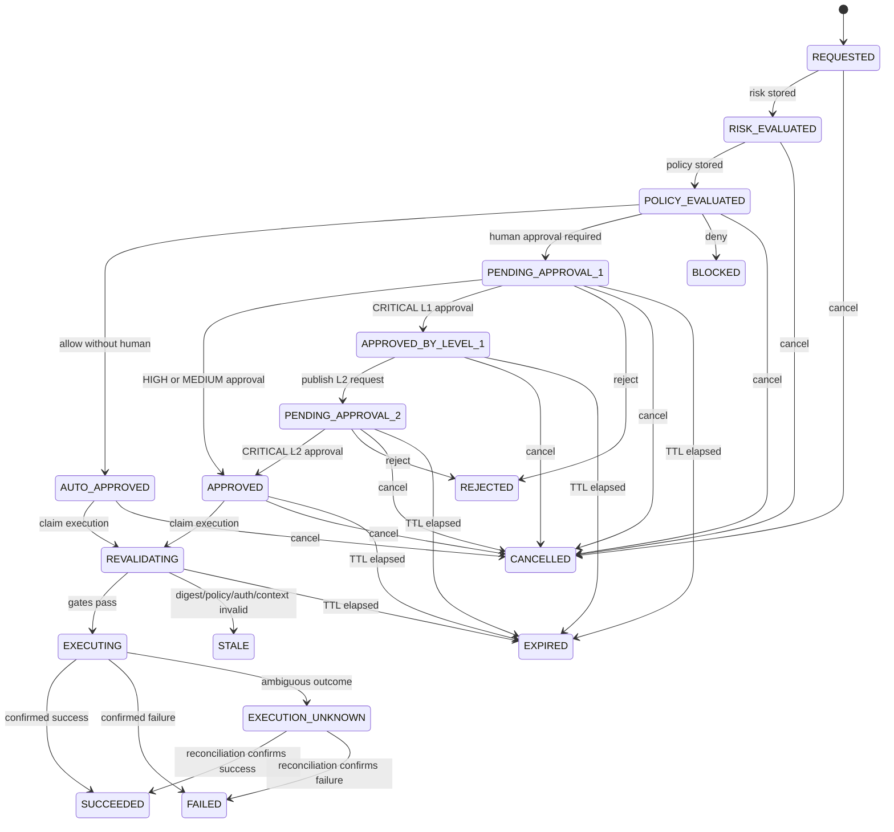
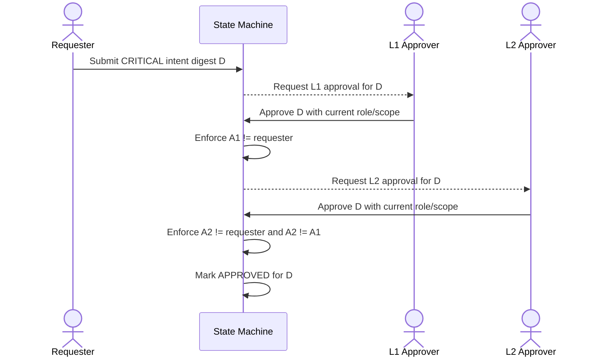
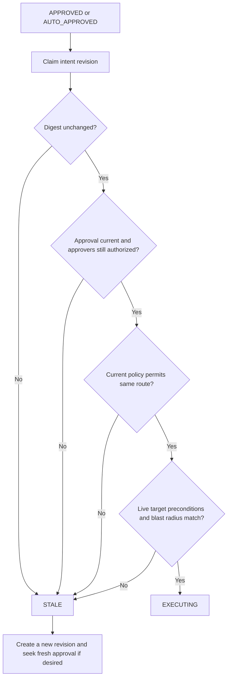

# Approval State Machine

**Status:** PROPOSED_FOR_REVIEW  
**Authority:** This document defines legal lifecycle transitions. API routes, jobs, prompts, and adapters may request transitions but may not invent them.

## 1. States

| State | Meaning | Terminal |
|---|---|---:|
| `REQUESTED` | Valid canonical intent revision stored | No |
| `RISK_EVALUATED` | Deterministic risk result stored | No |
| `POLICY_EVALUATED` | Versioned policy decision stored | No |
| `AUTO_APPROVED` | Policy permits execution without human approval | No |
| `PENDING_APPROVAL_1` | Waiting for the first required approval | No |
| `APPROVED_BY_LEVEL_1` | CRITICAL L1 approved; waiting for L2 | No |
| `PENDING_APPROVAL_2` | L2 request is available | No |
| `APPROVED` | Required current approvals are present | No |
| `REVALIDATING` | Executor exclusively claims and rechecks all gates | No |
| `EXECUTING` | Adapter operation has begun | No |
| `SUCCEEDED` | Confirmed successful outcome | Yes |
| `FAILED` | Confirmed unsuccessful, non-ambiguous outcome | Yes |
| `EXECUTION_UNKNOWN` | Provider may have acted; reconciliation required | No |
| `BLOCKED` | Policy prohibits the action | Yes |
| `REJECTED` | Authorized human rejected it | Yes |
| `CANCELLED` | Requester/operator cancelled before execution | Yes |
| `EXPIRED` | Approval window elapsed before execution claim | Yes |
| `STALE` | Intent/policy/authorization/context no longer satisfies approval | Yes for this revision |

`STALE` does not return to approval. A changed material action is a new revision with a new digest and starts at `REQUESTED`.

## 2. Main lifecycle

Cancellation is legal from `REQUESTED`, `RISK_EVALUATED`, `POLICY_EVALUATED`, `AUTO_APPROVED`, `PENDING_APPROVAL_1`, `APPROVED_BY_LEVEL_1`, `PENDING_APPROVAL_2`, and `APPROVED`. Expiry is legal from approval-waiting and approved states. No cancellation is accepted after the `REVALIDATING` execution claim.

## 3. Critical two-step approval

The L2 request is not valid until L1 approval commits. Each approval stores `intent_id`, `revision`, `intent_digest`, `level`, `decision`, `actor_id`, `actor_roles_snapshot`, `scope_snapshot`, `reason`, `policy_version`, `decided_at`, and `expires_at`.

## 4. Transition contract

Every transition requires:

1. A command with actor, correlation ID, expected state, and expected `state_version`.
2. A locked current row (`SELECT … FOR UPDATE`) or an atomic compare-and-swap update.
3. Validation against a static transition table plus transition-specific guards.
4. New `state_version = old + 1` and a same-transaction audit outbox row.
5. A unique command/idempotency key so replay returns the committed result.

Invalid transitions return `409 STATE_CONFLICT`. Authorization failures return `403 FORBIDDEN` without revealing cross-tenant intent existence.

## 5. Guard rules

- Only current, unexpired approvals for the current digest count.
- `APPROVED` is derived by transition guards; clients cannot set it.
- An approver must be authorized at decision time and again at execution time.
- A rejection wins if it commits before the execution claim. After the claim, the API reports the action already started.
- Expiry uses server/database time, never client time.
- A policy change is re-evaluated. A stricter result stales the revision; an equal/less strict result does not manufacture missing approvals.
- `EXECUTION_UNKNOWN` is resolved only by provider status lookup/reconciliation using the same provider operation key.

## 6. Stale approval and revalidation

## 7. Invariants to test

- A terminal revision cannot transition except `EXECUTION_UNKNOWN` reconciliation.
- At most one successful execution claim exists per intent revision.
- CRITICAL approval cannot be satisfied by fewer than two distinct authorized non-requesters.
- No approval applies to another tenant, revision, policy obligation, or digest.
- No executable state exists without risk and policy records.
- Every committed transition has exactly one corresponding audit event/outbox record.

